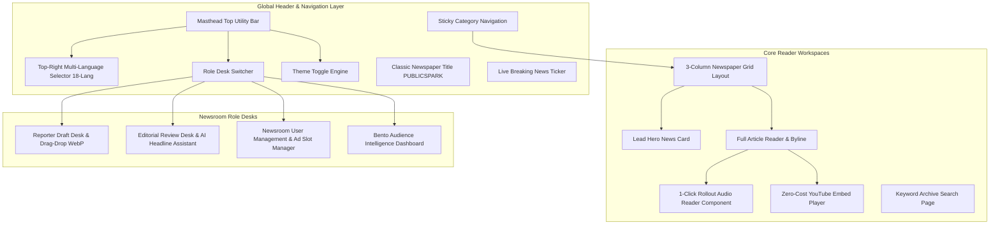

# PublicSpark — UI/UX Technical Design Requirement (UI-UX TDR)

**Document Version:** 2.0  
**Status:** Approved for Frontend Implementation  
**Derived From:** PublicSpark PRD v2.0 & TDR v2.0  
**Design Theme:** Bento Digital Newsroom & High-End Editorial Newspaper  

---

## 1. Executive Summary & Design System Overview

This Technical Design Requirement (TDR) defines the formal **UI/UX Architecture and Visual Design System** for **PublicSpark**. PublicSpark is engineered to deliver an authentic, human-designed newsroom aesthetic resembling premier global publications (*The Verge, The Guardian, Indian Express*) with Bento Grid layout principles.

### Key Visual Commitments
1. **Journalistic Credibility**: Elegant serif headlines (`Playfair Display`, `Lora`), classic masthead layout, fact-check guarantee badges (`ShieldCheck`), breaking news ribbons (`Flame`), and prominent author bylines.
2. **Rollout Audio Reader UI**: Smooth rollout animation transforming from a compact round play button to an expanded interactive audio bar with equalizer animation and timeline scrubber.
3. **Dynamic Multi-Language Experience**: Streamlined top-right corner language selector supporting real-time translation and audio reading across 18 languages.
4. **Fluid Dual-Theme Engine**: High-contrast, accessibility-audited color palettes for Light Newsprint Mode (`#FAF8F5`) and Dark Carbon Mode (`#0B0F17`).

---

## 2. High-Level Component & UI Architecture



---

## 3. Design Tokens & Styling Specifications (`src/index.css`)

All interface styles are anchored to standardized CSS design tokens declared in [`src/index.css`](file:///d:/my%20projects/pintu%20chachu%20news%20web/src/index.css):

```css
/* Light Newsprint Theme (Default) */
:root {
  --bg-main: #FAF8F5;          /* Warm newsprint off-white background */
  --bg-surface: #FFFFFF;       /* Pure white card surface */
  --bg-secondary: #F3EFEA;     /* Muted container background */
  
  --text-main: #111827;        /* Deep charcoal main text */
  --text-muted: #374151;       /* Medium dark body text */
  --text-subtle: #6B7280;      /* Subtle metadata text */
  
  --accent-crimson: #C5221F;   /* Classic newspaper crimson red */
  --accent-indigo: #6366F1;    /* Interactive audio player indigo */
  --accent-emerald: #059669;   /* Fact-checked guarantee badge green */
  --accent-amber: #D97706;     /* Breaking news alert amber */
  
  --border-light: #E5E7EB;     /* Thin component border */
  --border-medium: #D1D5DB;    /* Section divider line */
  --masthead-border: #111827;  /* Traditional double-rule masthead line */
  
  --radius-sm: 6px;
  --radius-md: 10px;
  --radius-lg: 16px;
  --shadow-sm: 0 1px 3px rgba(0,0,0,0.05);
  --shadow-md: 0 4px 12px rgba(0,0,0,0.08);
}

/* Dark Carbon Theme (Night Reading Mode) */
[data-theme="dark"] {
  --bg-main: #0B0F17;          /* Deep carbon dark background */
  --bg-surface: #161F2E;       /* Dark navy card surface */
  --bg-secondary: #1E293B;     /* Secondary dark container */
  
  --text-main: #F9FAFB;        /* Bright white title text */
  --text-muted: #D1D5DB;       /* Off-white body text */
  --text-subtle: #9CA3AF;      /* Muted gray timestamps */
  
  --border-light: #1F2937;
  --border-medium: #374151;
  --masthead-border: #F9FAFB;
}
```
